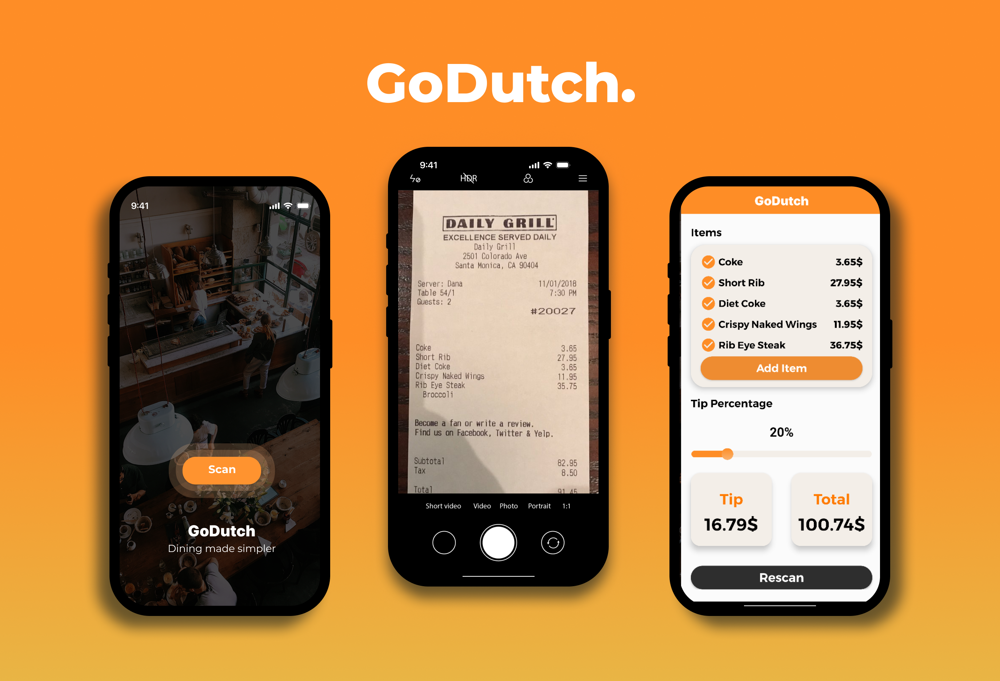

<h1 align="left">GoDutch - Dinning made simpler.</h1>

###

### The idea behind the App

###

 **GoDutch** is a native Android App which simplifies group payments, particularly in situations like splitting a restaurant bill. In many social settings, figuring out who owes what can be a cumbersome and time-consuming task. **GoDutch** aims to make this process seamless by leveraging **OCR (Optical Character Recognition) technology** to automatically scan and process the bill.

With **GoDutch**, each user can:
- **Scan the bill** quickly using OCR, which recognizes items and their prices.
- **Select the items they ordered**, ensuring a fair split of the total.
- **Calculate their share**, including tip, making it easy to determine how much each person needs to pay.

**GoDutch** removes the hassle of manual calculations, providing a user-friendly way to manage group expenses accurately and efficiently. This app is designed to enhance social experiences by reducing the stress and confusion around bill-splitting, allowing users to focus on what matters – enjoying the moment.

###

## Table of Contents
- [Showcase](#showcase)
- [Technologies Used](#technologies-used)
- [License](#license)
- [Contact](#contact)

## Showcase

## Technologies Used

###

  <!-- Android Studio -->
  
  
  
  <!-- SQLite -->
  
  
  
  <!-- Figma -->
  

###

- **Language**: [Android Studio](https://developer.android.com/studio) with Java – For building the native Android app with a focus on performance and platform-specific features.
- **Database**: [SQLite](https://www.sqlite.org/) – For managing local data storage efficiently within the app, allowing for offline access and fast data retrieval.
- **Design Tool**: [Figma](https://www.figma.com/) – For prototyping and designing the UI components with a modern and user-friendly layout.

###

## License

This project is licensed under the MIT License. You are free to use, modify, and distribute this code, provided that you include the original license. 

You can view the full text of the MIT License [here](https://opensource.org/licenses/MIT).

## Contact

  
  

